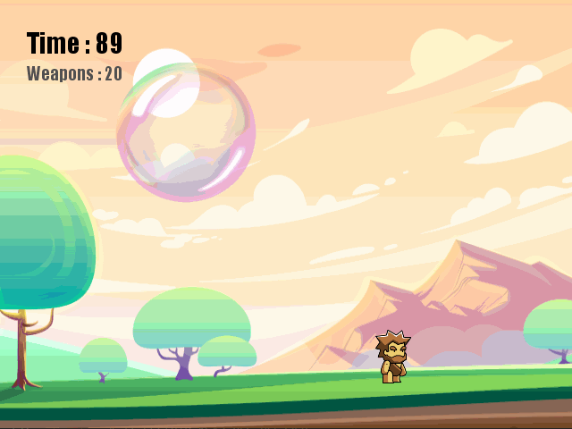

# bubble-pop-game

## Description

"Bubble Pop: The Caveman" is a recreated version of a classic arcade game, ["Bubble Trouble Classic"](https://play.google.com/store/apps/details?id=com.kresogames.bubbletrouble&hl=en&gl=US), built with Python and Pygame. The goal of this game is to help the caveman eliminate all the bouncing bubbles without getting hit by the bubbles. Starting from a single giant bubble, each bubble will be split into two smaller bubbles once it gets popped by a spear. The player must keep splitting the bubbles until they get small enough to disappear (need to pop 15 bubbles in total).

## Rules

1. The caveman is given 20 spears and 100 seconds to eliminate all the bouncing bubbles.
2. The bubbles will have four different sizes. Starting from one giant bubble, the bubbles get smaller as they are split by the spear.
3. To complete the game, the player must keep splitting the bubbles until they disappear (15 bubbles in total).
4. The game will end if the caveman gets hit by a bubble.
5. The game will end if the caveman runs out of spears (20 spears).
6. The game will end if the caveman fails to complete the game in time (100 seconds).

## Installation

I used the pygame module (version 1.9.6) with Python 3.7.2

```bash
pip install pygame
```

## Usage

Clone the handmotion-control repository in your directory.

```bash
git clone https://github.com/byunsy/bubble-pop-game.git
```

Move to your specific directory and execute the program.

```bash
python bubble_pop.py
```

## Demonstrations

The caveman successfully eliminates all bubbles.


The caveman gets hit by a bubble.



## References

The images used in this game were from free graphic-resources communities listed below:

1. [Original background image and ground image](https://www.freepik.com/search?dates=any&format=search&page=1&query=valley-cross-section-soil-wiyh-fossils) -- created by upklyak.

2. [Weapon (spear) image](https://www.hiclipart.com/free-transparent-background-png-clipart-zoldp)

3. [Protagonist (caveman) image](https://www.hiclipart.com/free-transparent-background-png-clipart-dpsig)

4. [Bubble image](https://www.hiclipart.com/free-transparent-background-png-clipart-isieg)
